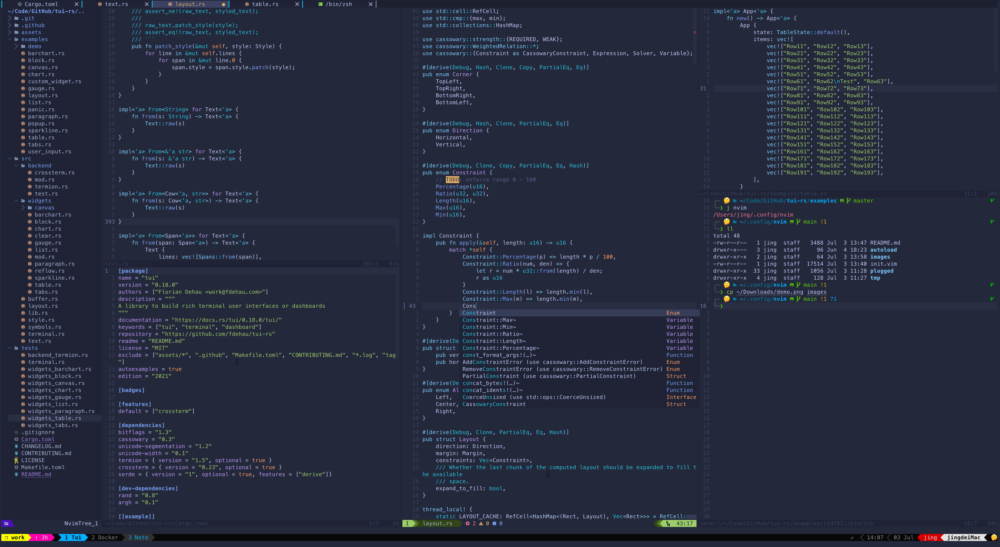

<div align='center'>
  
</div>



## 如何安装

首先确保已经安装 [neovim](https://github.com/neovim/neovim/wiki/Installing-Neovim)

### 安装 packer

Packer 是一个插件管理器

```bash
git clone --depth 1 https://github.com/wbthomason/packer.nvim\
 ~/.local/share/nvim/site/pack/packer/start/packer.nvim
```

### 克隆仓库

```bash
git clone git@github.com:KURANADO2/neovim-config.git --depth=1 ~/.config/nvim
```

### 插件依赖安装

```bash
# nvim-telescope/telescope.nvim 所需依赖
brew install ripgrep
npm install -g fd-find

# 格式化相关
brew install stylua
pnpm i -D prettier eslint
rustup component add rustfmt

# davidgranstrom/nvim-markdown-preview 所需依赖
brew install pandoc
npm install -g live-server

# Esc 离开 Insert 模式自动切换输入法为英文
brew tap daipeihust/tap && brew install im-select

# 识别 python3, See Also: https://www.reddit.com/r/neovim/comments/i65pwd/no_python3_provider_found_run_checkhealth_provider/
python3 -m pip install --user --upgrade pynvim

# rust-analyzer
brew install rust-analyzer
```

### 插件安装

进入 neovim 执行：

```bash
:PackerSync
```

markdown-preview.nvim 插件需要手动安装：

```bash
cd ~/.local/share/nvim/site/pack/packer/start/
git clone https://github.com/iamcco/markdown-preview.nvim.git
cd markdown-preview.nvim
yarn install
yarn build
```

### LSP Laguage Server 安装

进入 neovim 执行：
neovim/nvim-lspconfig 自动补全

```bash
:LspInstallInfo
```

选择需要的 Language Server，按 `i` 安装、`x` 卸载、`U` 更新

### 语法高亮

进入 neovim 执行：

```bash
:TSInstallInfo 查看可用的语言
```

执行 `:TSInstall 语言名称` 即可安装，例如：

```bash
:TSInstall c
:TSInstall java
:TSInstall go
:TSInstall rust
:TSInstall python
:TSInstall lua
```

## 快捷键

### 模式

| 快捷键  | 功能   |
| -       | -      |
| `⌃` `v` | 行模式 |
| `V`     | 块模式 |


### 光标移动

Tips：为了突破 Mac 系统按键重复限制，建议执行如下两条命令以加速按键重复以及缩短重复前间隔（命令执行后需重启系统方可生效）

```bash
defaults write NSGlobalDomain KeyRepeat -int 1
defaults write NSGlobalDomain InitialKeyRepeat -int 10
```

| 快捷键  | 功能                             |
| -       | -                                |
| `⌃` `j` | 向下移动 5 行                    |
| `⌃` `k` | 向上移动 5 行                    |
| `⌃` `h` | 移动到行首（行首不为空的字符处） |
| `⌃` `l` | 移动到行尾                       |
| `J`     | Nomal 模式下向下翻页 5 行        |
| `K`     | Nomal 模式下向上翻页 5 行        |
| `H`     | 向左翻页 20 个字符               |
| `L`     | 向右翻页 20 个字符               |
| `J`     | Visual 模式下向下移动选中文本    |
| `K`     | Visual 模式下向下移动选中文本    |

### 多光标

| 快捷键  | 功能                                               |
| -       | -                                                  |
| `⌃` `n` | 选中相同单词                                       |
| `n`     | 继续选择下一个相同的单词                           |
| `N`     | 继续选择上一个相同的单词                           |
| `[`     | 在已选择的单词之间跳转到上一个单词                 |
| `]`     | 在已选择的单词之间跳转到下一个单词                 |
| `q`     | 取消选中当前位置的已选中单词并选择下一个相同的单词 |
| `Q`     | 取消选中当前位置的已选中单词                       |
| `⌃` `↑` | 向上创建多光标                                     |
| `⌃` `↓` | 向下创建多光标                                     |
| `⇧` `←` | 向左扩选                                           |
| `⇧` `→` | 向右扩选                                           |

### 选中

| 快捷键      | 功能                              |
| -           | -                                 |
| `v` `i` `e` | 全选                              |
| `↩︎`         | 扩选（相当于 vi' vi" vi( vi{ 等） |
| `⌫`         | 缩选（相当于 vi' vi" vi( vi{ 等） |

### 宏

| 快捷键 | 功能                                                    |
| -      | -                                                       |
| `sga`  | 录制宏到寄存器 a，同理 sgb 即录制宏到寄存器 b，以此类推 |

### 撤销

| 快捷键 | 功能 |
| -      | -    |
| `u`    | 撤销 |
| `U`    | 重做 |

### LSP

| 快捷键      | 功能                   |
| -           | -                      |
| `␣` `r` `n` | 变量重命名             |
| `␣` `c` `a` | Code Action            |
| `g` `d`     | 跳转到定义             |
| `g` `r`     | 查看所有引用的地方     |
| `g` `h`     | 查看提示               |
| `g` `p`     | 以浮动方式查看错误提示 |
| `g` `j`     | 跳转到下一个错误提示   |
| `g` `k`     | 跳转到上一个错误提示   |
| `⌃` `j`     | 向下选择代码提示       |
| `⌃` `k`     | 向上选择代码提示       |

### 其它代码补全

| 快捷键  | 功能           |
| -       | -              |
| `␣` `;` | 在行尾补上分号 |

### 参数

| 快捷键          | 功能               |
| -               | -                  |
| `␣` `s` `w`     | 交换参数位置       |

### 代码折叠

| 快捷键  | 功能     |
| -       | -        |
| `z` `c` | 代码折叠 |
| `z` `o` | 代码展开 |

### 更改包裹符号

| 快捷键          | 功能                                                                                         |
| -               | -                                                                                            |
| `c` `s` `'` `"` | 将单引号更改为双引号（此处的单引号、双引号也可以替换为其它符号，如圆括号、中括号、花括号等） |

### 注释

| 快捷键      | 功能                                 |
| -           | -                                    |
| `g` `c` `c` | Normal 模式下注释/取消注释           |
| `g` `c`     | Visual 模式下注释/取消注释           |
| `⌃` `/`     | Normal 或 Visual 模式下注释/取消注释 |

### 格式化

| 快捷键      | 功能                                                                               |
| -           | -                                                                                  |
| `␣` `f`     | 格式化代码                                                                         |
| `␣` `p` `j` | 预览格式化后的 Json                                                                |
| `␣` `w` `j` | 格式化 Json                                                                        |
| `␣` `a`     | 根据特定字符对齐文本（快捷键之后需要输入字符后回车，以根据输入的字符进行文本对齐） |

### 文件

| 快捷键 | 功能            |
| -      | -               |
| `q`    | 关闭当前 Buffer |
| `S`    | 保存文件        |
| `Q`    | 退出            |

### 文件树

| 快捷键  | 功能                                                            |
| -       | -                                                               |
| `t` `t` | 打开/关闭文件树                                                 |
| `␣` `n` | 在文件树中定位到当前获取焦点的文件                              |
| `o`     | 打开文件或展开目录                                              |
| `r`     | 重命名                                                          |
| `c`     | 复制文件                                                        |
| `x`     | 剪切文件                                                        |
| `p`     | 粘贴文件                                                        |
| `a`     | 创建文件或目录（如果以 / 结尾则表示创建目录，否则即为创建文件） |
| `R`     | 刷新文件树                                                      |
| `I`     | 显示/隐藏 .gitignore 忽略的文件                                 |
| `.`     | 显示/隐藏 dotfiles（隐藏文件）                                  |

### 大纲

| 快捷键  | 功能                   |
| -       | -                      |
| `␣` `o` | 打开/关闭大纲          |
| `⌃` `j` | 移动到下一条大纲并预览 |
| `⌃` `k` | 移动到上一条大纲并预览 |

### 标签页切换

| 快捷键  | 功能                 |
| -       | -                    |
| `E`     | 切换到左侧标签页     |
| `R`     | 切换到右侧标签页     |
| `W`     | 切换到最左侧标签页   |
| `T`     | 切换到最右侧标签页   |
| `t` `h` | 将当前标签页向左移动 |
| `t` `l` | 将当前标签页向右移动 |

### 窗口分割

| 快捷键  | 功能                               |
| -       | -                                  |
| `s` `h` | 向左侧分割出新窗口                 |
| `s` `j` | 向下方分割出新窗口                 |
| `s` `k` | 向上方分割出新窗口                 |
| `s` `l` | 向右侧分割出新窗口                 |
| `s` `d` | 将水平分割的窗口重新布局为垂直分割 |
| `s` `f` | 将垂直分割的窗口重新布局为水平分割 |
| `s` `=` | 调整窗口为等比例                   |
| `s` `c` | 关闭当前窗口                       |
| `s` `o` | 关闭其他窗口                       |

### 窗口大小

| 快捷键 | 功能             |
| -      | -                |
| `←`    | 横向调整窗口大小 |
| `→`    | 横向调整窗口大小 |
| `↑`    | 纵向调整窗口大小 |
| `↓`    | 纵向调整窗口大小 |

### 窗口切换

| 快捷键  | 功能           |
| -       | -              |
| `␣` `h` | 切换到左侧窗口 |
| `␣` `j` | 切换到下方窗口 |
| `␣` `k` | 切换到上方窗口 |
| `␣` `l` | 切换到右侧窗口 |

### 大小写

| 快捷键 | 功能       |
| -      | -          |
| &#96;  | 大小写转换 |

### 高亮

| 快捷键  | 功能         |
| -       | -            |
| `␣` `↩︎` | 取消搜索高亮 |

### 搜索

| 快捷键      | 功能         |
| -           | -            |
| `␣` `f` `f` | 搜索文件名称 |
| `␣` `f` `g` | 搜索字符串   |
| `␣` `f` `b` | 搜索 Buffer  |
| `␣` `f` `h` | 搜索 Tag     |
| `⌃` `j`     | 向上移动     |
| `⌃` `k`     | 向下移动     |

### 书签

| 快捷键  | 功能                   |
| -       | -                      |
| `m` `m` | 打书签                 |
| `m` `a` | 查看所有书签           |
| `m` `a` | 清除当前文件内所有书签 |
| `m` `x` | 清除所有文件的书签     |
| `m` `n` | 跳转到下一个书签       |
| `m` `N` | 跳转到上一个书签       |

### Git

| 快捷键      | 功能         |
| -           | -            |
| `␣` `t` `g` | 打开 Lazygit |
| `q`         | 退出 Lazygit |

### 输入法

| 快捷键 | 功能                                                 |
| -      | -                                                    |
| `⎋`    | 切换到英文输入法（由 INSERT 模式切换到 NORMAL 模式） |

### Markdown

| 快捷键      | 功能                          |
| -           | -                             |
| `␣` `m` `p` | Markdown 预览                 |
| `␣` `t` `m` | 启用/禁用 Markdown table 模式 |

### 终端

| 快捷键      | 功能                             |
| -           | -                                |
| `␣` `t` `a` | 以浮动窗口方式打开终端           |
| `␣` `t` `b` | 在右侧打开终端                   |
| `␣` `t` `c` | 在下方打开终端                   |
| `⎋`         | 由 INSERT 模式切换为 NORMAL 模式 |
| `Q`         | 退出终端                         |
